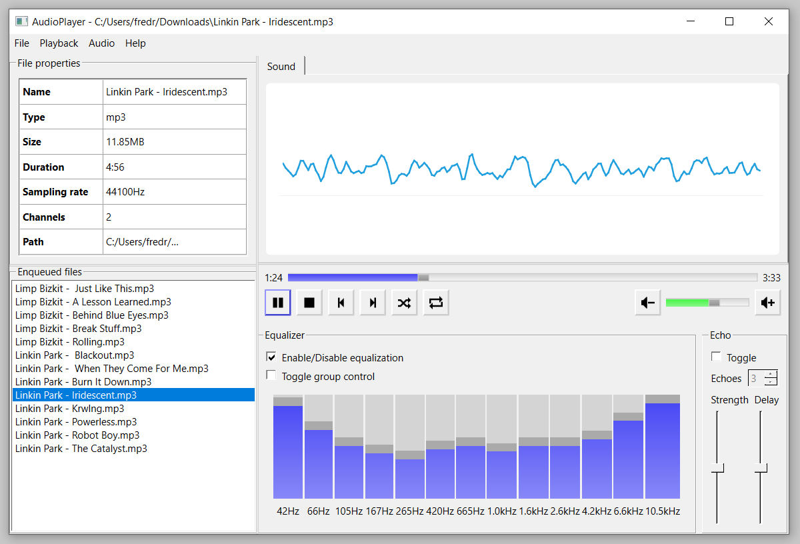

# AudioPlayer with GUI - from (almost) scratch

This project features a cross-platform Audio player, able to read WAV and MP3 files, with some processing effects (graphical equalizer, echo...) and playback queue management. This project is still work in progress and any feedback would be appreciated.

## Introduction

This project introduces one of the most basic ways to create a generic sound player from (almost) scratch. Most algorithm implementations are naive at best and not optimized for now since this project is also a work in progress. Later on - it will include sound analysis and real time display of frequency/phases spectrum and a more accurate equalizer (with Butterworth filtering, but implemented right).

Once the underlying "sounds" library package will be mature enough, it will be its own git repository aiming to provide a simple Sound playback, synthesis, processing and analysis framework.  (the main.cpp second part shows a bit the direction of the project).

## Dependencies
- Qt 
- Portaudio
- OpenMP3

## Compilation

Compilation is pretty straightforward. Just install Qt 6.1.X  for open source, and in the CMakeLists,txt file, indicate Qt location, usually found at C://Qt/x.x.x/msvc2019_64 for windows.

Then  you should be good to go. If you are on Ubuntu/Linux, be sure you have at least one audio backend development library installed such as pulse audio or alsa development packages. 

$cmake build
$cd build
$make

## Future plans

- Real time or pseudo real time spectrum for phase and amplitudes
- Better equalizer (once my mastery of FIR/IIR filtering catches up)
- More effects (reverb, pitch correction, flanging, phasing, chorus...)
- Sound/music synthesis framework
- Larger file formats support
- Tests! Adept of TDD, there is not a single test written yet. Yikes. Shoud be fixed soon
